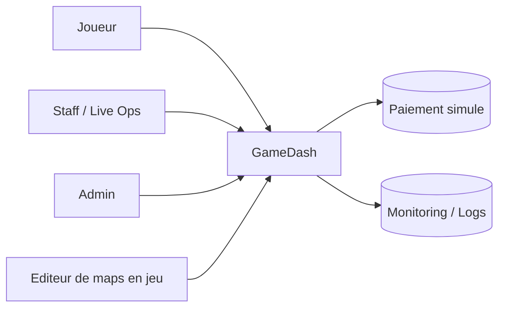
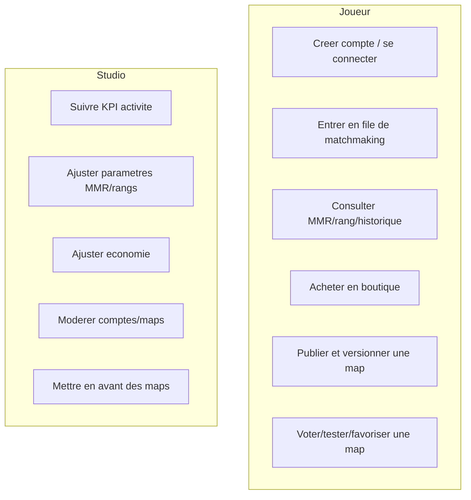
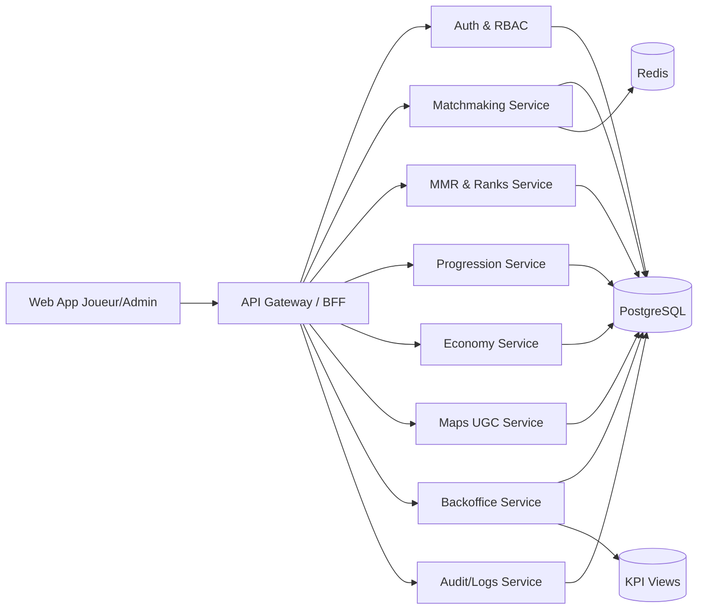
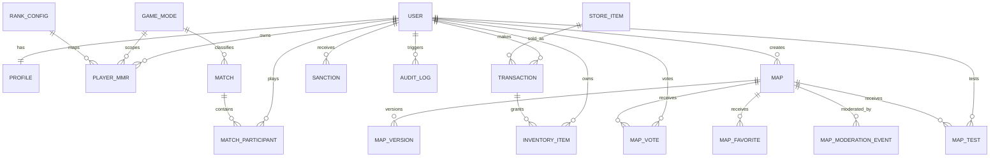
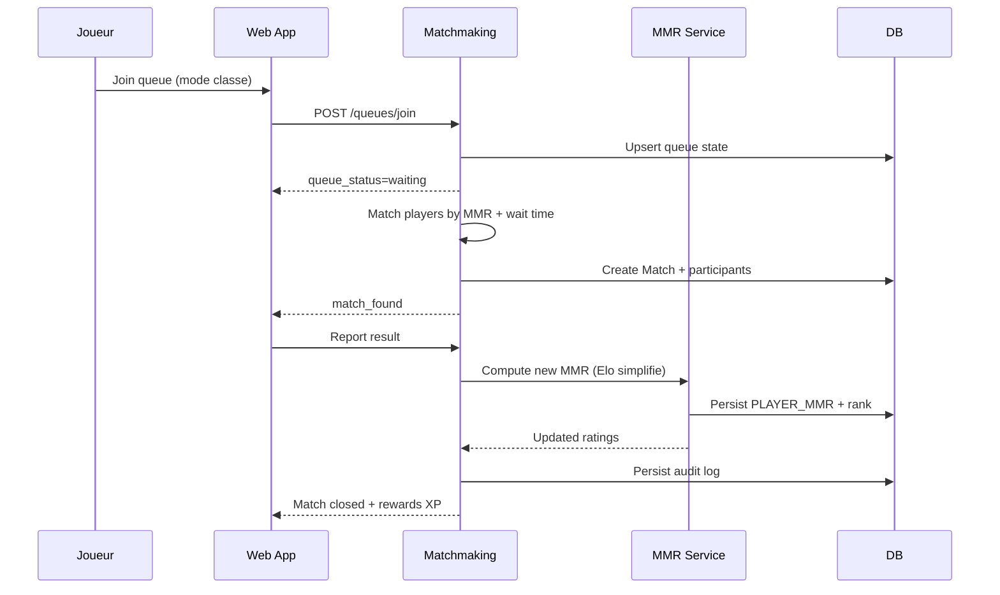
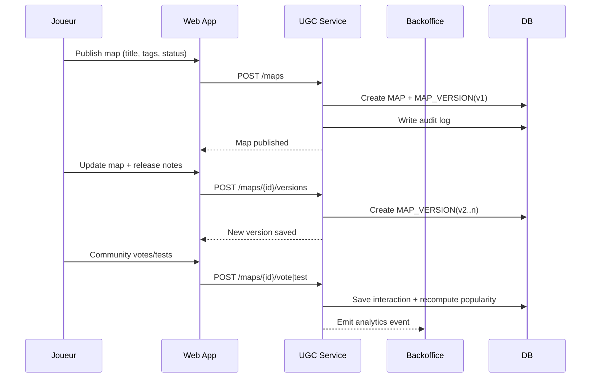
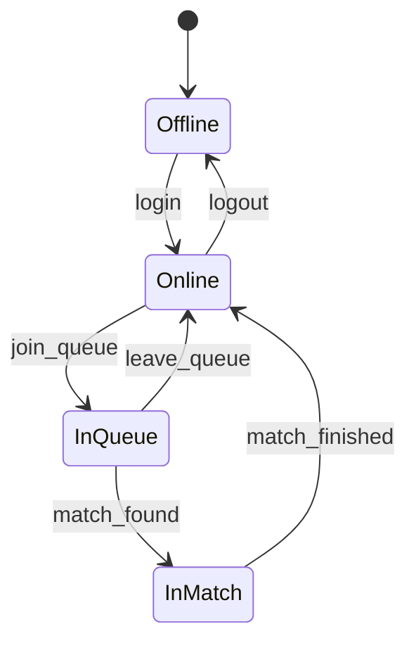

# Diagrammes GameDash (Mermaid)

## 1. Diagramme de contexte

## 2. Cas d'usage principaux

## 3. Diagramme de composants applicatifs

## 4. Modèle de données (ERD simplifié)

## 5. Séquence - matchmaking + mise à jour MMR

## 6. Séquence - publication/versionnage de map

## 7. État joueur dans le matchmaking

